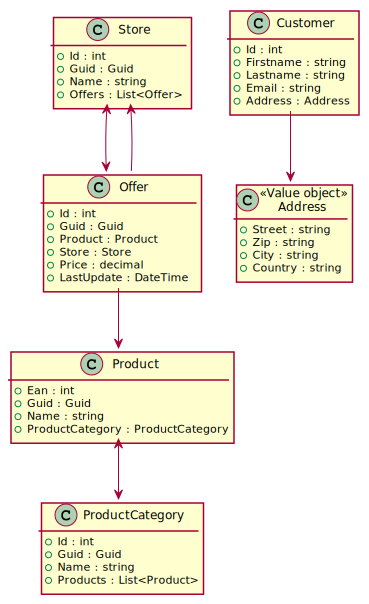
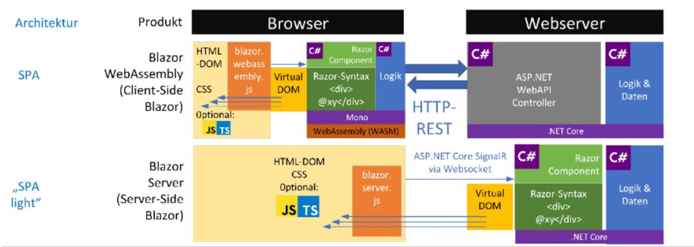

# Blazor Webassemblies

## Starten des Projektes

Die Solution in [ScsOnlineShop/ScsOnlineShop.sln](ScsOnlineShop/ScsOnlineShop.sln) kann in
Visual Studio geöffnet und ausgeführt werden. In der Konsole kann mit *dotnet run* das API
Projekt gestartet werden:

```text
cd ScsOnlineShop\ScsOnlineShop.Api
dotnet run
```

Es öffnet sich der Browser und die WASM wird geladen. Im Debug Modus ist jedes Login mit
mindestens 2 Buchstaben gültig.

## Inhalt

- [Start](10Start.md)
- [DTO Klassen](20Dtos.md)
- [Verwenden von AutoMapper](21AutoMapper.md)
- [Controller anlegen](30Controller.md)
- [Erste Komponenten](40Components.md)
- [Komponenten kommunizieren miteinander: Parameter](41Paramters.md)
- [Render Fragments und ref: Die Modal Komponente](42RenderFragments.md)
- [Ein RestService für die Webassembly](50RestService.md)
- [Authentication: API absichern](60AuthenticationApi.md)
- [Authentication: WASM Implementierung](61AuthenticationWasm.md)

Im Ordner *ScsOnlineShop* befindet sich eine vollständige Implementierung einer WASM Applikation. Die Demo simuliert ein Shopping Center, in dem mehrere Stores Produkte
anbieten können. Kunden können dann nach Produkten suchen und im jeweiligen Store
die Ware kaufen.

Das Klassenmodell ist im *Application* Projekt als EF Core Model umgesetzt:



<sup>
https://www.plantuml.com/plantuml/uml/dP71IWCn48RlUOhSfIzGbbAfLOIYGjM3jxYPjYERf6GcXo9zTsURf4XKaEQI_D-4-NzcviGcSdA3sg453MxF1-s0Ty6IKlrWYFIQGmJzgRISgtkhfnezPtMNSDJZbS63SI20EABVPlIusK0aWIiaxavgfeugT-qcava-iUAMnJ_TdcAmgMTXvPLnRZtDmUjFx4TaeKTdXWnNXlXbRmsFbHkvdj61H5CvWqGhBSww-jImHIuCmpR4m-L3AetEOofQ1jLOLOkbyHTwrB1IROYO5PBtqfHhaaKY3kwl9TrY9FO_tLVcLxnq1eU6NLiRWKXeUKcmiwa4gxW6gl-xxjKC2NHu_m2PtQm6N7C4uCRa3VSDMI0VMXIIv_YD7jKSl4rk-080
<sup>


## Webassemblies


<sup>
Quelle: https://www.heise.de/ratgeber/Webprogrammierung-mit-Blazor-WebAssembly-Teil-1-Web-API-Aufrufe-und-Rendering-4932237.html
</sup>
